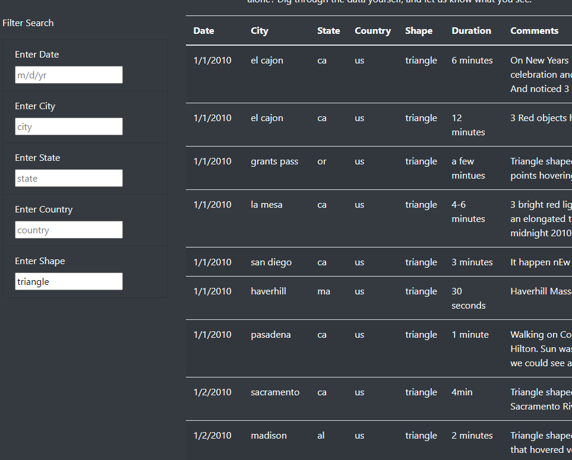

# UFOs

### Overview of the analysis:
The purpose of this project is to create a web page with a database of UFO sightings which is filterable by five criteria - date of sighting, city, state, and country of sighting, and shape of the UFO in the sighting. 

### Results:

One can filter the data in the table on the webpage by entering their parameters in the textboxes to the left of the table. 
Below, one can see as an example, all of the entries for sightings of triangular flying objects.

### Summary:

This webpage does not hold much information in its database, and the data file would have to be manually updated for the site to be current. It would be helpful to include additional information outside of 2010.

It would be helpful to create a news source scrape to find information on new UFO sightings without having the manually populate the field. It would also be interesting, if we are able to begin to collect our own data, to add additional search parameters and a "total" number of sightings meter to keep track of the table's size. Maybe something above the table with " N number of sightings recorded! "
